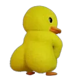

# AntD spinner swap

## Что это

Userscript, позволяющий подменить все спиннеры на сайте с использованием AntD 5 на кастомную картинку

## Как пользоваться

### Установка скрипта

1. Установить расширение, позволяющее запускать userscript. \
   Например [violentmonkey](https://violentmonkey.github.io/) (тестировалось на нем под chrome)
2. Установить сам скрипт перейдя по этой [ссылке](https://github.com/half-public-tools/antd-spinner-swap/raw/main/antd-spinner-swap.user.js) или вставив эту ссылку в настройках расширения

### Подмена спиннера

В консоль разработчика в среде, где планируете подменить спиннер прописать команду
```js
localStorage.setItem('antd-spinner-swap', '[ссылка на картинку]');
```

---

В этом репозитории есть несколько картинок, которые можно поставить:

- `https://github.com/half-public-tools/antd-spinner-swap/raw/main/spinners/duck.webp` \
  
- ... будут еще)


### Как добавить страницы

1. Необходимо зайти в настройки скрипта в расширении \
    Для violent monkey: 
    1. Зайти в настройки расширения
    2. Кликнуть по кнопке edit (кнопка со значком `</>`) в карточке скрипта
    3. Перейти во вкладку `settings`
2. Добавить список страниц, на которых скрипт должен работать (можно использовать `*`)
3. Снять галочку `keep original` в настройке `@exclude-match rules`
4. Сохранить изменения (для violent monkey кнопка `save` в правом верхнем углу)


> Для каждого домена своя настройка спиннера


### Про картинки для спиннера
Картинка должна быть небольшой и квадратной. 

Если в картинке одновременно нужна прозрачность и анимация рекомендуется использовать формат `webp`

Видео файлы (в том числе `webm`) не поддерживаются

### Возврат исходного спиннера
Можно либо выключить / удалить скрипт в настройках расширения, либо прописать команду в консоль разработчика
```js
localStorage.setItem('antd-spinner-swap', undefined);
```
и перезагрузить страницу


## Добавление новых спиннеров в этот репозиторий
Открывайте PR и пишите в личку
